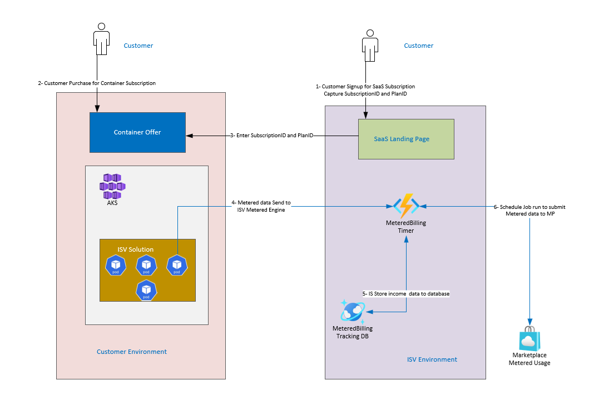

# SaaS-Metered-Demo

This repo shows HOW-TO deploy  Azure Container Offer with SaaS offer as Bundle to provide Metered feature.

For more about Azure Container Offer please review the following resources

## Azure Container Offer Resources
You can learn more about Azure Container offer using the following resources
1. [Mastering The Marketplace](https://microsoft.github.io/Mastering-the-Marketplace/container/)
1. [Azure Container Offer overview](https://learn.microsoft.com/en-us/azure/marketplace/marketplace-containers)

## Azure SaaS Offer Resources
You can learn more about Azure Container offer using the following resources
1. [Mastering The Marketplace](https://microsoft.github.io/Mastering-the-Marketplace/saas/)
1. [Azure SaaS Offer overview](https://learn.microsoft.com/en-us/azure/marketplace/plan-saas-offer)

The following Diagram shows how the SaaS and Container offer will interact together to provide metered usage capability.
## Demo Diagram

There is the expected workflow steps
1. ISV will publish SaaS and Continers offers
1. Customer will subscribe to SaaS Plan
1. Customer will capture the subscription GUID and plan information
1. Once Subscription is Activate it then Customer will subscribe to container offer and deploy it.
1. As part of deployment, UI definition may request Subscription GUID and Plan. In this demo this information needed. However, ISV can capture the subscription information by other means.
1. The container solution will send metered information to ISV.
1. In this implementation container solution is sending metered information Azure Function HTTP Trigger endpoint
1. Azure Function HTTP Trigger will store the information to CosmosDB
1. ISV will submit metered information to MP using Batch or PUT process.
1. In this implementation Azure Function Timer will run every hour and check the CosmosDB to collect the metered information and submit it to MP.

## Contributing

This project welcomes contributions and suggestions.  Most contributions require you to agree to a
Contributor License Agreement (CLA) declaring that you have the right to, and actually do, grant us
the rights to use your contribution. For details, visit https://cla.opensource.microsoft.com.

When you submit a pull request, a CLA bot will automatically determine whether you need to provide
a CLA and decorate the PR appropriately (e.g., status check, comment). Simply follow the instructions
provided by the bot. You will only need to do this once across all repos using our CLA.

This project has adopted the [Microsoft Open Source Code of Conduct](https://opensource.microsoft.com/codeofconduct/).
For more information see the [Code of Conduct FAQ](https://opensource.microsoft.com/codeofconduct/faq/) or
contact [opencode@microsoft.com](mailto:opencode@microsoft.com) with any additional questions or comments.

## Trademarks

This project may contain trademarks or logos for projects, products, or services. Authorized use of Microsoft 
trademarks or logos is subject to and must follow 
[Microsoft's Trademark & Brand Guidelines](https://www.microsoft.com/en-us/legal/intellectualproperty/trademarks/usage/general).
Use of Microsoft trademarks or logos in modified versions of this project must not cause confusion or imply Microsoft sponsorship.
Any use of third-party trademarks or logos are subject to those third-party's policies.
